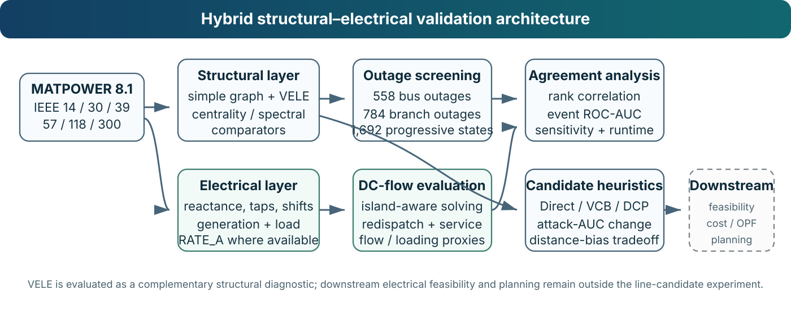
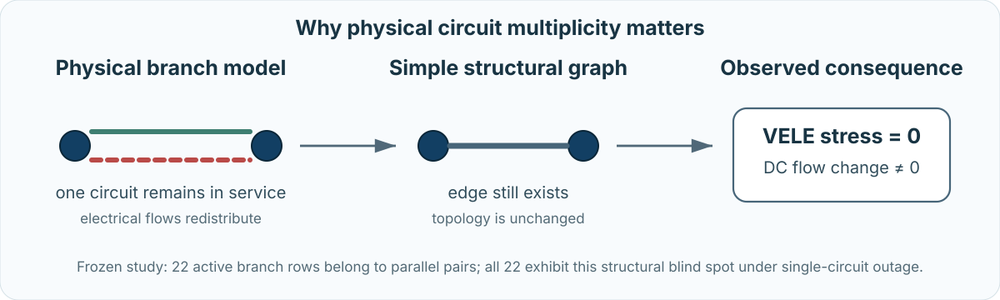

<p align="center">
  
</p>

<h1 align="center">VELE Power-Grid Vulnerability Screening</h1>

<p align="center">
  <strong>Reproducibility repository for</strong><br/>
  <strong>Computational Power-Grid Vulnerability Screening Using Vertex Eccentricity Labeled Energy and DC-Flow Validation</strong>
</p>

<p align="center">
  <a href="https://github.com/SunilgarGusai/VELE-PowerGrid-Reproducibility/actions/workflows/repository-validation.yml"></a>
  <a href="https://github.com/SunilgarGusai/VELE-PowerGrid-Reproducibility/actions/workflows/matpower-octave-validation.yml"></a>
  <a href="https://github.com/SunilgarGusai/VELE-PowerGrid-Reproducibility/releases/tag/v1.0.0-submission"></a>
  <a href="environment.yml"></a>
  <a href="https://matpower.org/"></a>
  <a href="docs/FROZEN_RESULTS.md"></a>
  <a href="LICENSE"></a>
</p>

<p align="center">
  <a href="#why-this-study">Why this study?</a> •
  <a href="#method-at-a-glance">Method</a> •
  <a href="#key-evidence">Key evidence</a> •
  <a href="#reproducibility">Reproducibility</a> •
  <a href="#result-to-source-map">Result map</a> •
  <a href="#citation">Citation</a>
</p>

---

## Why this study?

Power-grid topology is informative, but topology alone does not determine electrical severity. A structurally important outage may produce modest active-power consequences, while an electrically severe event may be nearly invisible to a topology-only descriptor.

This repository accompanies a study of **Vertex Eccentricity Labeled Energy (VELE)** as an eccentricity-sensitive spectral screening diagnostic evaluated against electrical consequences rather than treated as a stand-alone resilience score.

> **Central question:** What vulnerability signal is contributed by an eccentricity-sensitive spectral descriptor, and when does that signal agree—or fail to agree—with DC-flow redistribution and service consequences?

The study deliberately retains mixed and negative findings:

- degree is a stronger generic flow-redistribution ranker than VELE in the frozen single-bus comparison;
- VELE is informative for some disconnection and secondary-shedding targets but not universally;
- IEEE39 contains unfavorable branch-event results;
- simple-graph VELE cannot see the loss of one circuit in a surviving parallel pair;
- `RATE_A` active-power exceedance results can depend strongly on redispatch assumptions.

These are part of the scientific conclusion, not exceptions hidden from it.

## Method at a glance

The study uses a **dual representation** of each MATPOWER case: a simple structural graph for VELE and comparators, and a physical electrical representation retaining branch reactance, taps/phase shifts, generation, demand, circuit multiplicity and ratings where available.

<p align="center">
  
</p>

Candidate-line heuristics are evaluated separately from downstream electrical feasibility. Direct-VELE, VCB-VELE and DCP-VELE are **structural candidate-screening rules**; the study does not invent unsupported electrical parameters, costs or planning constraints for hypothetical lines.

See [`docs/METHOD_PROTOCOL.md`](docs/METHOD_PROTOCOL.md) for the frozen computational protocol.

## Study design

| Evidence block | Frozen scope |
|---|---:|
| Benchmark systems | **6** — IEEE 14 / 30 / 39 / 57 / 118 / 300 |
| Single-bus outage cases | **558** |
| Physical branch-outage cases | **784** |
| Progressive electrical states | **1,692** |
| Structural line-candidate families | Direct-VELE / VCB-VELE / DCP-VELE |
| Executable intact-system cross-check | MATPOWER 8.1 under GNU Octave |

Single-bus removals are stylized bus/substation-loss screening cases, not conventional line/generator N-1 compliance. Physical branch outages are evaluated one row at a time and explicitly retain the distinction between electrical branch rows and simple structural edges.

## Key evidence

The repository exposes manuscript-supporting results directly through machine-readable CSV files and validation reports. A complete reviewer-facing summary is available in [`docs/FROZEN_RESULTS.md`](docs/FROZEN_RESULTS.md).

| Evidence | Frozen result | Interpretation |
|---|---:|---|
| Branch outages causing residual disconnection | **114 / 784** | Quantifies topology-sensitive branch consequences |
| Branch outages causing secondary surviving-load shedding | **47 / 784** | Adds an electrical service-consequence proxy |
| IEEE118 VELE vs flow redistribution | Spearman **0.287**, FDR q **0.0012** | Modest positive structural-electrical alignment |
| IEEE300 VELE vs flow redistribution | Spearman **0.255**, FDR q **0.0012** | Modest positive alignment in the largest case |
| IEEE118 residual-disconnection ROC-AUC | **0.845** | Strong structural ranking for this target |
| IEEE300 residual-disconnection ROC-AUC | **0.877** | Strong structural ranking for this target |
| IEEE300 secondary-shedding ROC-AUC | **0.838** | Useful event discrimination in the largest case |
| IEEE39 residual-disconnection ROC-AUC | **0.384** | Explicit unfavorable case |
| IEEE39 `RATE_A` active-power exceedance ROC-AUC | **0.520** | Near-chance result under the primary dispatch proxy |
| Repeated executable MATPOWER agreement | **< 1e-12 deg**, **< 1e-11 MW** | Clean-run validation of intact DC angles and branch flows |

Residual disconnection is a **structural event**, not independent electrical validation. The electrical validation layer is carried by DC-flow redistribution, surviving-load shedding/service retention, active-power-to-`RATE_A` diagnostics where ratings are available, redispatch sensitivity and executable MATPOWER cross-checking.

## A limitation worth keeping visible

The physical-branch experiment exposes a specific topology-only blind spot: simple graphs do not retain physical circuit multiplicity.

<p align="center">
  
</p>

In the frozen analysis:

- **22** active branch rows belong to parallel pairs;
- all **22** have zero VELE stress when one circuit trips while another survives;
- all still produce nonzero DC-flow redistribution;
- more broadly, **269 / 784** physical branch outages produce numerically zero bounded VELE stress.

This is one reason the study treats VELE as a **complementary structural diagnostic**, not as a general critical-transmission-line index.

## Executable MATPOWER 8.1 validation

A dedicated GitHub Actions workflow independently checks the intact DC implementation in a clean cloud environment. It:

1. starts from a clean Ubuntu runner;
2. installs GNU Octave;
3. downloads the official MATPOWER 8.1 release and verifies its SHA-256 checksum;
4. executes MATPOWER `rundcpf` on all six intact benchmark systems;
5. independently parses and solves the same DC equations in NumPy;
6. compares bus voltage angles and branch active-power flows;
7. fails automatically if the declared tolerances are exceeded.

Two complete clean-run summaries are committed. Their final floating-point digits differ slightly, as expected across hosted runners, but both remain well inside the declared `1e-8` tolerances. The environment-robust statement is therefore:

> repeated executable MATPOWER 8.1 / GNU Octave checks agree within **1e-12 degrees** in bus angle and **1e-11 MW** in branch active-power flow.

This validates the **intact benchmark DC equations and branch-flow implementation**. The custom island handling, generator redispatch and load-curtailment proxies remain separate study methodology and are not represented as native MATPOWER security-analysis functionality.

## Reproducibility

The public repository is designed as an **auditable scientific artifact**, not as an unexplained code dump.

### Live reviewer-facing branch

The current `main` branch contains:

- executable MATPOWER/Octave and NumPy validation utilities;
- selected portable stage code;
- physical-branch frozen summary outputs;
- benchmark provenance and licensing records;
- CI workflows and validation reports;
- a frozen method protocol and result map;
- publication-grade navigation and scientific visuals.

### Frozen public release

The [`v1.0.0-submission`](https://github.com/SunilgarGusai/VELE-PowerGrid-Reproducibility/releases/tag/v1.0.0-submission) release preserves the **complete public computational submission snapshot**, including staged inputs/outputs, portable reproduction entry points, validation evidence, technical documentation and integrity checks.

The submitted manuscript PDF/source, cover letter and journal-submission files are intentionally excluded from the public release during peer review.

### Environment

The public environment is specified in [`requirements.txt`](requirements.txt) and [`environment.yml`](environment.yml):

- Python 3.13
- NumPy 2.3.5
- pandas 2.2.3
- SciPy 1.17.0
- NetworkX 3.6.1
- matplotlib 3.10.8
- tabulate 0.10.0

```bash
conda env create -f environment.yml
conda activate vele-powergrid
```

or use the lightweight pip route documented in [`QUICKSTART.md`](QUICKSTART.md).

### Validate the public branch

The repository's **Repository verification** workflow performs dependency installation, file checks, Python syntax checks, CLI smoke tests and numerical evidence invariants on pushes and pull requests.

For local reviewer-facing smoke checks:

```bash
python validation/python_dcpf_reference.py --help
python validation/compare_matpower_python.py --help
```

See [`docs/REPRODUCIBILITY.md`](docs/REPRODUCIBILITY.md) for the exact boundary between the live branch and frozen release.

## Result-to-source map

| Manuscript evidence | Machine-readable repository source |
|---|---|
| Physical-branch network totals | [`branch_n1_network_summary.csv`](stages/07_branch_outage_validation/outputs/branch_n1_network_summary.csv) |
| VELE/electrical branch correlations | [`branch_n1_vele_correlations.csv`](stages/07_branch_outage_validation/outputs/branch_n1_vele_correlations.csv) |
| Branch event ROC-AUC | [`branch_n1_vele_event_auc.csv`](stages/07_branch_outage_validation/outputs/branch_n1_vele_event_auc.csv) |
| Branch redispatch sensitivity | [`branch_n1_redispatch_sensitivity_summary.csv`](stages/07_branch_outage_validation/outputs/branch_n1_redispatch_sensitivity_summary.csv) |
| MATPOWER executable reference cross-check | [`matpower_octave_crosscheck_summary.csv`](validation/results/matpower_octave_crosscheck_summary.csv) |
| MATPOWER repeated clean-run cross-check | [`matpower_octave_crosscheck_summary_run_35533409590.csv`](validation/results/matpower_octave_crosscheck_summary_run_35533409590.csv) |
| Benchmark/data provenance | [`docs/DATA_SOURCE_MANIFEST.md`](docs/DATA_SOURCE_MANIFEST.md) |
| Full reviewer-facing result guide | [`docs/FROZEN_RESULTS.md`](docs/FROZEN_RESULTS.md) |
| Complete public snapshot | [`v1.0.0-submission`](https://github.com/SunilgarGusai/VELE-PowerGrid-Reproducibility/releases/tag/v1.0.0-submission) |

## Repository structure

```text
.
├── .github/workflows/            # repository and MATPOWER/Octave CI
├── config/                       # frozen high-level study configuration
├── docs/
│   ├── assets/                   # banner and scientific workflow visuals
│   ├── METHOD_PROTOCOL.md        # frozen computational protocol
│   ├── FROZEN_RESULTS.md         # headline result inventory + source map
│   ├── REPRODUCIBILITY.md        # live-branch/release verification guide
│   └── DATA_SOURCE_MANIFEST.md   # MATPOWER provenance
├── stages/
│   ├── 01_matpower_preparation/  # portable preparation code
│   └── 07_branch_outage_validation/
│       └── outputs/              # reviewer-facing branch results
├── validation/                   # independent DC + executable MATPOWER cross-check
├── CITATION.cff
├── environment.yml
├── requirements.txt
├── REPOSITORY_MANIFEST.csv
└── QUICKSTART.md
```

The curated [`REPOSITORY_MANIFEST.csv`](REPOSITORY_MANIFEST.csv) explains the role of each reviewer-facing artifact.

## Scientific scope and limitations

This repository supports a **computational graph-based vulnerability-screening study for power grids**. It does not establish that VELE is universally superior to conventional structural centralities or electrical indicators.

Important boundaries include:

- topology-only descriptors do not encode MW demand/generation or physical circuit multiplicity;
- simple-graph VELE can be blind to one-of-two parallel-circuit outages;
- DC power flow omits voltage-magnitude, reactive-power and nonlinear AC effects;
- load-shedding and redispatch are deterministic screening proxies rather than OPF;
- active-power-to-`RATE_A` loading is a DC diagnostic, not full AC thermal enforcement;
- candidate-line heuristics are structural screens, not transmission-expansion optimizers;
- absolute runtimes are hardware/software dependent.

## Release status

**Current status: journal-submission reproducibility repository.**

The public computational state is frozen in release [`v1.0.0-submission`](https://github.com/SunilgarGusai/VELE-PowerGrid-Reproducibility/releases/tag/v1.0.0-submission). Publication metadata and a DOI can be added to `CITATION.cff` after publication without changing the frozen numerical evidence.

## Authors

- **Sunilgar L. Gusai** — corresponding author, Faculty of Computer Applications, Marwadi University  
  ORCID: [0009-0004-0739-4812](https://orcid.org/0009-0004-0739-4812)
- **Manoharsinh R. Jadeja** — Department of Artificial Intelligence, Machine Learning and Data Science, Marwadi University  
  ORCID: [0000-0003-1833-4730](https://orcid.org/0000-0003-1833-4730)

## Citation

Citation metadata are provided in [`CITATION.cff`](CITATION.cff). Cite the associated article when publication metadata become available and use the frozen `v1.0.0-submission` release when referring to the computational submission state.

## License and third-party materials

Original project code is released under the **MIT License**. MATPOWER software and benchmark materials retain their original upstream terms and are not relicensed by this repository. See [`THIRD_PARTY_LICENSES.md`](THIRD_PARTY_LICENSES.md) and [`docs/DATA_SOURCE_MANIFEST.md`](docs/DATA_SOURCE_MANIFEST.md).
