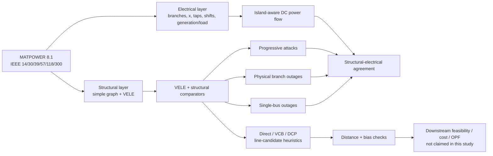

# VELE Power-Grid Vulnerability Screening

**Reproducibility repository for**  
**Vertex Eccentricity Labeled Energy for Power-Grid Vulnerability Screening with DC-Flow Validation**

[](https://github.com/SunilgarGusai/VELE-PowerGrid-Reproducibility/actions/workflows/repository-validation.yml)
[](https://github.com/SunilgarGusai/VELE-PowerGrid-Reproducibility/actions/workflows/matpower-octave-validation.yml)
[](https://github.com/SunilgarGusai/VELE-PowerGrid-Reproducibility/releases/tag/v1.0.0-submission)
[](https://matpower.org/)
[](#benchmark-coverage)
[](LICENSE)

## Why this study?

Power-grid topology is informative, but topology alone does not determine electrical severity. This study asks a deliberately narrower question:

> **What vulnerability signal is contributed by an eccentricity-sensitive spectral descriptor, and when does that signal agree—or fail to agree—with DC-flow and service consequences?**

Vertex Eccentricity Labeled Energy (VELE) is therefore evaluated as a **training-free, deterministic structural screening diagnostic**, not as a substitute for contingency analysis, OPF, dynamic stability, cascading-failure simulation, protection studies or transmission-expansion optimization.

The study uses six IEEE/MATPOWER benchmark systems and combines structural graph analysis with island-aware DC-flow validation, single-bus outages, physical branch outages, progressive attacks, structural comparators, redispatch sensitivity, event discrimination, runtime analysis and executable MATPOWER cross-checking.



## Key evidence at a glance

| Evidence | Frozen result | Why it matters |
|---|---:|---|
| IEEE/MATPOWER systems | **6** | IEEE 14, 30, 39, 57, 118 and 300 |
| Single-bus outage cases | **558** | Structural and electrical outage screening |
| Physical branch-outage cases | **784** | One-at-a-time screen of every active branch row |
| Progressive electrical states | **1,692** | Random, adaptive-degree and adaptive-betweenness trajectories |
| Branch outages causing residual disconnection | **114 / 784** | Quantifies topology-sensitive outage consequences |
| Branch outages causing secondary surviving-load shedding | **47 / 784** | Adds an electrical service-consequence proxy |
| Parallel branch rows | **22** | All are a known topology-only blind spot when one parallel circuit trips |
| Executable MATPOWER agreement | **< 1e-12 deg**, **< 1e-11 MW** | Repeated clean CI runs validate intact DC angles and branch flows |

### Selected branch-outage validation results

| Network / target | VELE result | Interpretation |
|---|---:|---|
| IEEE118 flow-redistribution stress | Spearman **0.287**, FDR q = **0.0012** | Modest positive structural-electrical alignment |
| IEEE300 flow-redistribution stress | Spearman **0.255**, FDR q = **0.0012** | Modest positive alignment in the largest benchmark |
| IEEE118 residual disconnection | ROC-AUC **0.845** | Strong structural ranking for disconnection-prone branch outages |
| IEEE300 residual disconnection | ROC-AUC **0.877** | Strong structural ranking for disconnection-prone branch outages |
| IEEE300 secondary shedding | ROC-AUC **0.838** | Useful service-event discrimination in the largest benchmark |
| IEEE39 residual disconnection | ROC-AUC **0.384** | Important unfavorable case; VELE is not universally strong |
| IEEE39 RATE_A active-power exceedance | ROC-AUC **0.520** | Near-chance result under the primary dispatch proxy |

Residual disconnection is a **structural event**, not independent electrical validation. The genuinely electrical validation layer is carried by DC-flow redistribution, surviving-load shedding/service retention, active-power-to-`RATE_A` loading where ratings are available, redispatch sensitivity and executable MATPOWER cross-checks.

## A key limitation made explicit

The physical-branch experiment exposes where simple-graph screening cannot see circuit multiplicity.

When one circuit of a parallel pair is removed while another remains, the simple structural edge is unchanged. In the frozen analysis:

- **22** active branch rows belong to parallel pairs;
- all **22** produce zero VELE stress under single-circuit removal while DC flow redistribution remains nonzero;
- more broadly, **269 / 784** physical branch outages produce numerically zero bounded VELE stress.

This is not hidden as a failure mode. It is part of the scientific conclusion: **VELE is complementary structural information, not a general critical-transmission-line index.**

## Benchmark coverage

- IEEE 14
- IEEE 30
- IEEE 39
- IEEE 57
- IEEE 118
- IEEE 300
- MATPOWER **8.1** is the frozen benchmark source
- transformer taps and phase shifts are retained in the electrical layer
- parallel physical branches remain separate electrically
- missing thermal ratings are **not fabricated**

## What the framework contains

1. component-wise VELE for disconnected residual graphs;
2. bounded VELE structural-deviation/stability normalization;
3. Direct-VELE line-candidate score;
4. centrality-balanced VCB-VELE;
5. distance/cost-penalized DCP-VELE;
6. single-bus outage screening;
7. complete physical branch-outage screening;
8. progressive random and adaptive attacks;
9. island-aware DC power flow;
10. deterministic redispatch and secondary load-curtailment proxy;
11. flow-redistribution and branch-loading diagnostics;
12. structural comparator analysis;
13. correlation, event discrimination and sensitivity analysis;
14. runtime/scalability analysis;
15. independent executable MATPOWER 8.1 / GNU Octave validation.

## Executable MATPOWER 8.1 validation — PASS

A GitHub Actions workflow independently validates the intact DC implementation in a clean Ubuntu environment. It downloads the official MATPOWER 8.1 release, verifies the archive hash, runs `rundcpf` under GNU Octave on all six intact benchmark systems, independently parses the same case matrices in NumPy, and compares bus angles and branch active-power flows.

Two clean CI executions remain comfortably inside the declared `1e-8` tolerances. The environment-robust summary used by the study is:

> **Repeated executable MATPOWER 8.1 / GNU Octave checks agree within 1e-12 degrees in bus angle and 1e-11 MW in branch active-power flow.**

The executable check validates the intact benchmark DC equations and branch-flow implementation. Custom island handling, redispatch and load-curtailment remain study-specific methodology rather than native MATPOWER security-analysis functionality.

## Reproducibility design

The public repository is organized as a reviewer-facing validation and provenance layer, while the frozen release preserves the complete computational submission state.

The workflow includes:

1. pinned MATPOWER provenance and case parsing;
2. structural graph reconstruction;
3. VELE and comparator calculations;
4. single-bus and physical branch outage evaluation;
5. island-aware DC-flow validation;
6. redispatch and flow-stress sensitivity;
7. finite-benchmark rank and event analyses;
8. runtime/scalability measurement;
9. executable MATPOWER/Octave cross-validation;
10. manifest and reproducibility checks.

## Result-to-source map

| Result / evidence | Machine-readable or reviewer-facing source |
|---|---|
| Branch-outage network summary | `stages/07_branch_outage_validation/outputs/branch_n1_network_summary.csv` |
| VELE vs. electrical branch-outage correlations | `stages/07_branch_outage_validation/outputs/branch_n1_vele_correlations.csv` |
| Branch event ROC-AUC results | `stages/07_branch_outage_validation/outputs/branch_n1_vele_event_auc.csv` |
| Redispatch sensitivity | `stages/07_branch_outage_validation/outputs/branch_n1_redispatch_sensitivity_summary.csv` |
| Branch-outage interpretation | `stages/07_branch_outage_validation/README.md` |
| MATPOWER executable validation report | `validation/results/MATPOWER_OCTAVE_VALIDATION_REPORT.md` |
| MATPOWER reference numerical summary | `validation/results/matpower_octave_crosscheck_summary.csv` |
| MATPOWER repeatability note | `validation/results/MATPOWER_OCTAVE_REPEATABILITY_NOTE.md` |
| Benchmark/data provenance | `docs/DATA_SOURCE_MANIFEST.md` |
| Complete frozen computational state | [`v1.0.0-submission`](https://github.com/SunilgarGusai/VELE-PowerGrid-Reproducibility/releases/tag/v1.0.0-submission) |

## Environment

Pinned reviewer-facing Python dependencies:

- NumPy 2.3.5
- pandas 2.2.3
- SciPy 1.17.0
- NetworkX 3.6.1
- matplotlib 3.10.8
- tabulate 0.10.0

Executable cross-validation additionally uses **GNU Octave + MATPOWER 8.1** in GitHub Actions.

## Repository layout

```text
.github/workflows/                 CI and executable MATPOWER validation
validation/                        independent NumPy / MATPOWER cross-check
stages/01_matpower_preparation/    benchmark preparation and provenance
stages/07_branch_outage_validation/branch-outage public results
stages/07_branch_outage_validation/README.md
stages/07_branch_outage_validation/outputs/
docs/                              source manifests and technical reports
QUICKSTART.md                      reviewer-facing commands
CITATION.cff                       citation metadata
THIRD_PARTY_LICENSES.md            upstream licensing notes
requirements.txt                   pinned Python environment
```

The frozen public [`v1.0.0-submission`](https://github.com/SunilgarGusai/VELE-PowerGrid-Reproducibility/releases/tag/v1.0.0-submission) release contains the complete computational reproducibility archive supporting the submission. The unpublished manuscript, manuscript source, cover letter and private journal files are intentionally not part of the public repository.

## Scientific scope and limitations

This work does **not** claim that VELE is universally superior to conventional structural centralities. It does not claim to predict AC voltage/reactive-power behavior, dynamic instability, protection actions, cascades or optimal expansion decisions. Proposed Direct/VCB/DCP links are structural candidate heuristics and are not assigned invented electrical parameters.

The intended role is narrower and testable:

> **VELE provides an eccentricity-sensitive structural signal that can complement subsequent electrical assessment when topology is informative, while explicit disagreement cases reveal when topology alone is insufficient.**

## Quick start

See [`QUICKSTART.md`](QUICKSTART.md) for commands that are valid on the current public `main` branch and for the distinction between the live reviewer-facing layer and the frozen release.

## Authors

- **Sunilgar L. Gusai** — corresponding author, Marwadi University
- **Manoharsinh R. Jadeja** — Marwadi University

## Citation

Citation metadata are provided in [`CITATION.cff`](CITATION.cff). For reproducibility, cite the frozen [`v1.0.0-submission`](https://github.com/SunilgarGusai/VELE-PowerGrid-Reproducibility/releases/tag/v1.0.0-submission) release.

## Academic profile and related research

This repository is part of the open-research programme of **Dr. Sunilgar L. Gusai**, spanning spectral graph theory, network science and reproducible computational modelling.

- Academic portfolio: https://sunilgargusai.github.io/sunilgar-portfolio/
- GitHub profile: https://github.com/SunilgarGusai
- ORCID: https://orcid.org/0009-0004-0739-4812
- Related reproducibility repository: https://github.com/SunilgarGusai/EGFR-Graph-QSAR-Reproducibility

## License

Original project code is released under the **MIT License**. MATPOWER software and benchmark materials retain their original upstream terms; see [`THIRD_PARTY_LICENSES.md`](THIRD_PARTY_LICENSES.md) and `docs/DATA_SOURCE_MANIFEST.md`.
